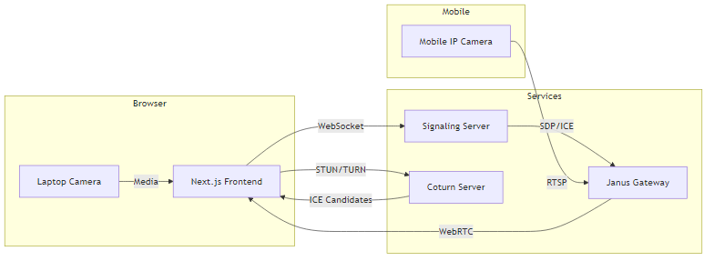

# Dual-Camera Call Demo

A browser-based multi-party dual-camera call demonstration. Each participant appears twice:

1. **Laptop webcam** via `getUserMedia`
2. **Phone camera** streamed as RTSP and bridged through Janus Gateway

---

## 🚀 Prerequisites

- **Docker & Docker Compose** (v1.29+)
- (Optional) **Node.js & npm** if you want to run services locally
- A **mobile IP camera app** that exposes an RTSP URL

---

## 🎬 Getting Started

1. **Clone the repository**
   ```bash
   git clone https://github.com/yourusername/DualCameraCallDemo.git
   cd DualCameraCallDemo
   ```
2. **Build & launch all services in one command**
   ```bash
   docker-compose up --build
   ```
3. **Open the frontend**  
   Navigate to: `http://localhost:3000`

The above will bring up:

| Service          | Description                   | Host Port → Container Port        |
| ---------------- | ----------------------------- | --------------------------------- |
| signaling-server | WebSocket signaling (Node.js) | 8765 → 4000                       |
| frontend         | Next.js UI                    | 3000 → 3000                       |
| coturn           | TURN/STUN relay               | 3478 → 3478                       |
| janus-gateway    | RTSP→WebRTC gateway (Janus)   | 7088, 8088, 8188, 10000–10200/UDP |

---

## 🏛 Architecture Diagram



_Figure 1: High-level architecture of the Dual-Camera Call Demo._

---

## ⚙️ Janus Streaming Plugin Configuration

Your RTSP stream is configured in:

```
janus/etc/janus/janus.plugin.streaming.jcfg
```

Example snippet:

```ini
stream1: {
  type        = "rtsp"
  id          = 1
  description = "Phone Camera"
  url         = "rtsp://192.168.1.100:8554/live"
  metadata    = "IP camera via RTSP"
  audio       = true
  video       = true
  videopt     = 96
  videortpmap = "H264/90000"
  audiopt     = 97
  audiortpmap = "opus/48000/2"
  debug_level = 7
}
```

> After updating `url`, restart Janus:
>
> ```bash
> docker-compose restart janus
> ```

---

## 🔄 Gateway Trade-Offs

- **Janus Gateway**
  - **Pros:** Built-in RTSP plugin, easy Docker integration, active community
  - **Cons:** Extra service to manage, learning curve for `.jcfg` syntax
- **Alternatives:** GStreamer (`webrtcbin`), mediasoup, or Pion offer more control but require custom wiring
- **Coturn:** Essential for NAT traversal—ensures ICE candidates can reach peers behind firewalls

---

## 🧪 Testing & Debugging

```bash
# Frontend logs
docker-compose logs -f frontend

# Signaling server logs
docker-compose logs -f signaling-server

# Janus gateway logs
docker-compose logs -f janus

# TURN server logs
docker-compose logs -f coturn
```

1. Visit `http://localhost:3000`
2. Allow camera & microphone access
3. You should see two tiles:
   - Your laptop feed
   - Your mobile RTSP feed
4. Hover over a tile to view live stats (RTT, bitrate, packet loss)

---
